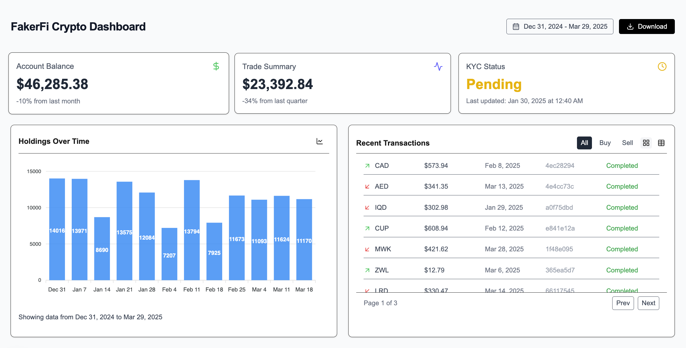

# FakerFi 🧪💸


A mock crypto dashboard built for InvestiFi’s coding challenge. Built with **Next.js**, **React**, **Tailwind CSS**, **shadcn/ui**, and **faker.js** for fake but realistic data. Deployed via **Vercel**.

## 🖼️ Preview



## Table of Contents

- [🌐 Live Demo](#-live-demo)
- [📖 Overview](#-overview)
- [🛠️ Tech Stack](#-tech-stack)
- [📦 Features](#-features)
- [🚀 Getting Started](#-getting-started)
- [🧪 Data Simulation](#-data-simulation)
- [🧩 Architecture & Design Decisions](#-architecture--design-decisions)
- [🧠 Opportunities for Further Improvement](#-opportunities-for-further-improvement)
- [🧠 Author](#-author)

## 🌐 Live Demo

👉 [https://faker-fi.vercel.app](https://faker-fi.vercel.app)

## 📖 Overview

This project simulates a customer-facing crypto investment dashboard where users can:

- View current account balance
- Manage KYC information
- See trade summaries
- View crypto transactions
- Track crypto holdings via bar charts

## 🛠️ Tech Stack

- [**React**](https://reactjs.org/) (v18)
- [**Next.js 14**](https://nextjs.org/)
- [**Tailwind CSS**](https://tailwindcss.com/) (v3.3)
- [**shadcn/ui**](https://ui.shadcn.com/) (Chart.js integration)
- [**faker.js**](https://fakerjs.dev) for mock data
- [**Vercel**](https://vercel.com/) for deployment

## 📦 Features

- Well-documented, atomic Git commits
- Responsive dashboard layout
- Grid of cards summarizing fake account data
- Bar chart for holdings over time
- Toggleable Grid/Table of recent transactions (buy/sell)
- Paginated, filterable table of recent transactions
- Global date range selection
- Downloadable CSV export

## 🚀 Getting Started

```bash
git clone https://github.com/izzydoesit/fakerfi.git
cd fakerfi
npm install
npm run dev
```

## 🧪 Data Simulation

Fake data is generated in `/lib/data.ts` using `@faker-js/faker`. This includes:

- Randomly generated trade activity (buy/sell)
- Account balances between $20,000–$50,000
- Weekly portfolio holding values
- KYC user data with status (Verified, Pending, Rejected)

## 🧩 Architecture & Design Decisions

This dashboard was designed to meet realistic expectations of a crypto finance platform while maximizing development efficiency. Key architectural choices:

- **Atomic component design:** UI elements are designed for modularity, separation of concerns, reusability, flexibility, and readability.

- **Hydration-safe data rendering:** All random or user-locale-sensitive data (like timestamps, balances, percent changes) is initialized inside useEffect() to avoid hydration mismatch errors between SSR and CSR.

- **Component memoization:** Used useMemo and usePagination hooks improve render performance and page control, avoid unnecessary re-computations for filtered trade data and paginated views.

- **Global date range context:** Used React Context API to provide consistent and globally accessible date range throughout the app to simplify shared state management across the app.

- **Dynamic grid/table toggle:** Allows multiple views of recent transaction data with persistent filtering and pagination.

- **Shadcn UI + Tailwind CSS:** For rapid, styled component development

## 🧠 Opportunities for Further Improvement

Given more time, here are a few improvements that could be implemented:

- **🧪 Unit & Integration Testing:**
  Add testing coverage with Jest + React Testing Library for critical components like HoldingsChart, RecentTransactions, and context providers.

- **🪝 Git Hooks with Husky:**
  Setup Husky + lint-staged to run Prettier and ESLint on every commit for a clean, enforced codebase.

- **🧼 ESLint & Prettier Configuration:**
  Add strict rules and auto-formatting with project-specific overrides for consistency and collaboration.

- **🔁 CI/CD Pipeline Enhancements:**
  Add GitHub Actions to run builds, test suites, and lint checks on every push or pull request to main.

- **📊 Advanced Charts:**
  Include interactive time series charts, tooltips, zoom support, and indicators with Chart.js or D3. Add pie chart for asset allocation.

- **🧵 Real Data Support:**
  Use actual API data for crypto markets and simulate WebSocket streaming for price updates.

- **💾 Data Persistance:** Leverage localStorage to save date range & view mode so users’ preferences persist between sessions

- **♿︎ Improved accessibility:** Add keyboard navigation and screen reader support

- **⤴️ Export options:** Export full trade history or holdings data to CSV or PDF

- **🗄️ State management upgrade:** Migrate from React Context to Zustand or Jotai for more scalable state management

- **🔐 Authentication Layer:**
  Add secure login to simulate personalized dashboards and session-based filtering.

- **📱 Mobile UI polish:** Further refine layout for smaller screens with collapsible sections

## 🧠 Author

**Israel Matos:** [GitHub](https://github.com/izzydoesit) | [LinkedIn](<(https://linkedin.com/in/izzy-matos)>)
